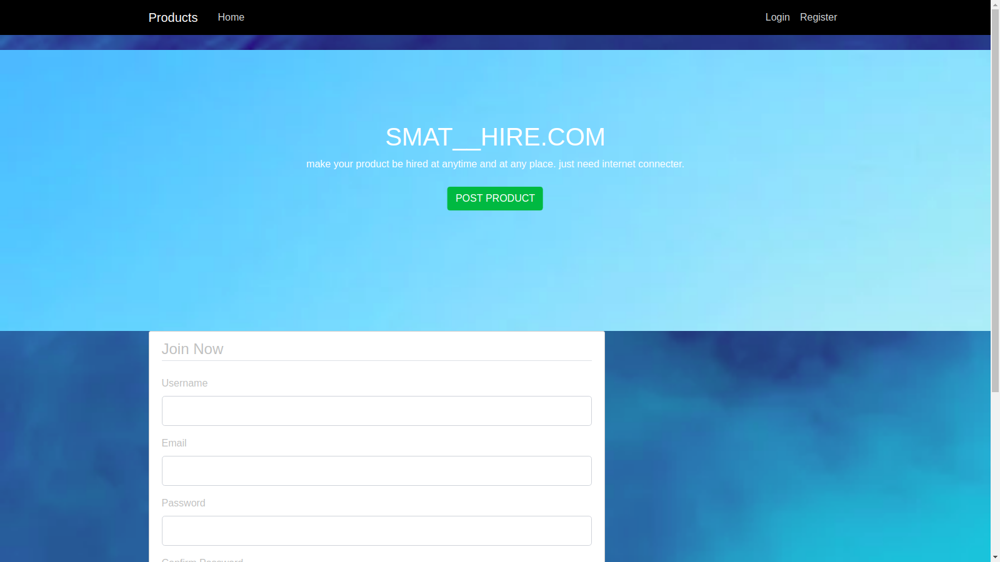

# Blogs
BLOGs is a personal blogging website where one can create and share  opinions.
 Other users can read and comment on opinions. 
Blogs also has random quotes that inspire the users. 

## Author
> Benson owino

## Screenshot

## Requirements

The following command installs all the application requirements
>``pip freeze -r requirements.txt``

## Installations

Run 
``git clone https://github.com/benowino7/blogs.git``

or download the zip file from github.

After extracting the files, 

1. Navigate to the project folder
>`` cd blogs.`` 

2. Creating a virtual environment
>``virtualenv virtual.``

3. Activating the virtual environment
>``source virtual/bin/activate.``

4. Running the application

>``python3 manage.py server``

5. Running tests

 > ``python3 manage.py test.``

## Technologies used
* Python3
* Flask
* Html5
* Css3
* Bootstrap4

## User stories
* As a user, I would like to view the blog posts on the site
* As a user, I would like to comment on blog posts
* As a user, I would like to view the most recent posts
* As a user, I would like to an email alert when a new post is made by joining a subscription.
* As a user, I would like to see random quotes on the site
* As a writer, I would like to sign in to the blog.
* As a writer, I would also like to create a blog from the application.
* As a writer, I would like to delete comments that I find insulting or degrading.
* As a writer, I would like to update or delete blogs I have created.

## BDD(Behaviour Driven Development)
>Login Inputs

| Inputs |  Description |
| :---         |          ---: |
| Username  | Account username, ``eg contech7``|
| Password  | Account password, ``eg pass``|

>Signup inputs

| Inputs |  Description |
| :---         |          ---: |
| Username  | Account username, ``eg contech7``|
| Email  | User email, ``eg contech7@testmail.com``|
| Password  | Account password, ``eg pass``|
| Confirm Password  | Account password, ``eg pass``|

> Blog inputs

| Inputs | Description  |
|---|---|
|  Blog title | the title of the blog eg; `` Comedy new story``  |
|  Blog post| The blog post itself|
| Comment| A comment on the blog post|

## License
> MIT License &copy; Benson Owino 2020

## Collaborate
To collaborate, reach me on [bensonowino7@gmail.com]()
## Github live Link
-https://blogs7.herokuapp.com/home

